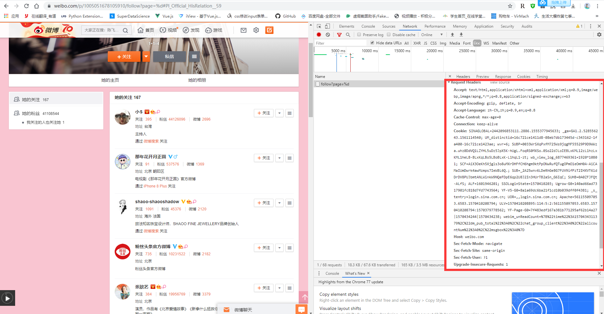

# HTTP协议简介  

#### __协议：协议是网络通信中制定的一种通信规则，所有信息必须按照该规则才能正常传输__
_HTTP协议（HyperText Transfer Protocol，超文本传输协议）是因特网上应用最为广泛的一种网络传输协议，所有的WWW文件都必须遵守这个标准。如：_ ***https://www.baidu.com***
_HTTP是一个基于TCP/IP通信协议来传递数据（HTML 文件, 图片文件, 查询结果等）。我们在网页上看到的大部分信息都是通过该协议传输过来的!_

### __协议工作原理__
**HTTP协议工作于客户端-服务端架构上,通俗来讲就是处于你的电脑跟互联网服务器之前的一种协议，用于保证你能够正常上网获取响应的HTML 文件, 图片文件, 查询结果等相关信息。在协议工作的时候，是你的电脑首先向别人的服务器发起请求，请求对方给你响应的信息，对方确认收到后才会把这个网页的信息发给你，这时你才能看到正常的网页信息**

### __协三点注意事项__
> *HTTP是无连接：每次只会处理一个请求。服务器处理完客户的请求，并收到客户的应答后，即断开连接。好比通话时每次只问一个问题，说一句话，解决完就挂电话，要问下一个问题只能再次接通电话*

> *HTTP是媒体独立的：只要客户端和服务器知道如何处理的数据内容，任何类型的数据都可以通过HTTP发送。好比接通电话后在相应的条件允许下，你们可以问任何问题。~~客户端以及服务器指定使用适合的MIME-type内容类型。~~*

> *HTTP是无状态：即协议对于事务处理没有记忆能力。缺少状态意味着如果后续处理需要前面的信息，则它必须重传，这样可能导致每次连接传送的数据量增大。这就相当于你跟对方通完话之后，对方立马就把你忘掉了，下次你再打电话过去，服务器已经不认识你了，如果电话在通话过程中中断，那么就要再打一次再确认一次信息，为了解决这个问题，HTTP协议提供了cookie保证协议的连贯性。另一方面，在服务器不需要先前信息时它的应答就较快，如果你问的问题是前后没有逻辑的，那就不需要确认信息，这就保证了效率。*

# python代码中的HTTP协议
_事实上，在我们使用代码去解决响应的协议问题的时候，我们并不需要直到其背后运转到哪一步了，我们只需要在意该怎么做，出现什么结果和错误即可，前人已经为我们做好了充足的准备工作，绝大部分工作相对于我们来说都相当的简单，比如执行一次请求：_  

```python
import requests
from bs4 import BeautifulSoup

results = requests.get('https://www.baidu.com/')#get方式请求该网址
results.encoding = results.apparent_encoding#获取网页编码，对网页内容进行编码，防止乱码产生
print(results.text)#查看返回结果
soup = BeautifulSoup(results.text)#配合BeautifulSoup获取标签内容
print(soup.title.text)
```

__在这个过程中程序对百度首页执行了一次HTTP请求，并且将返回的结果赋值给了results,我们可以想办法查看一下results中包含了什么东西，当我们修改网址或者断开网络连接这些值还能正常显示吗？__  

```python
print(type(results),'\n--------------------------------------------------------------')#这是一个怎样的类型
print(results.status_code,'\n--------------------------------------------------------------')#状态码是多少，两百表示正常链接，请求成功
print(type(results.text),'\n--------------------------------------------------------------')#返回的内容是怎样类型的信息
print(results.text,'\n--------------------------------------------------------------')#返回了怎样的内容
print(results.cookies,'\n--------------------------------------------------------------')#协议中的cookie是怎样的
```

# HTTP协议消息结构

### __客户的请求__
> *客户的请求其实远不止我们想象中的那么简单，并非像通话一样直接问，而是需要按照一定的格式传输相应的信息，这样对方服务器才能识别你请求的含义，网络中所有的信息传输都依照类似的规定，客户端发送一个HTTP请求到服务器的请求消息包括以下格式：请求行（request line）、请求头部（header）、空行和请求数据四个部分组成，下图给出了请求报文的一般格式。*
> 

### __服务器响应__
> *有请求就有响应，服务器的响应也必须按照规定的格式才能被本地接收，HTTP响应也由四个部分组成，分别是：状态行、消息报头、空行和响应正文。*
> 

#### **网络协议信息传输之所以如此复杂，其背后涵盖了众多因素，不仅牵扯到网络安全，也涉及传输效率。**  

# HTTP协议方法
* HTTP1.0 定义了三种请求方法： GET, POST 和 HEAD方法。
* HTTP1.1 新增了六种请求方法：OPTIONS、PUT、PATCH、DELETE、TRACE 和 CONNECT 方法。
* __在上一段内容的服务器响应所提供的图片中，第一行状态行表明了该协议为HTTP1.1__ *
<table>
<tbody><tr><th width="5%">序号</th><th width="10%">方法</th><th>描述</th></tr>
<tr><td>1</td><td>GET</td><td>请求指定的页面信息，并返回实体主体。</td></tr>
<tr><td>2</td><td>HEAD</td><td>类似于 GET 请求，只不过返回的响应中没有具体的内容，用于获取报头</td></tr>
<tr><td>3</td><td>POST</td><td>向指定资源提交数据进行处理请求（例如提交表单或者上传文件）。数据被包含在请求体中。POST 请求可能会导致新的资源的建立和/或已有资源的修改。</td></tr>
<tr><td>4</td><td>PUT</td><td>从客户端向服务器传送的数据取代指定的文档的内容。</td></tr>
<tr><td>5</td><td>DELETE</td><td>请求服务器删除指定的页面。</td></tr>
<tr><td>6</td><td>CONNECT</td><td>HTTP/1.1 协议中预留给能够将连接改为管道方式的代理服务器。</td></tr>
<tr><td>7</td><td>OPTIONS </td><td>允许客户端查看服务器的性能。</td></tr>
<tr><td>8</td><td>TRACE</td><td>回显服务器收到的请求，主要用于测试或诊断。</td></tr>
<tr><td>9</td><td>PATCH</td><td>是对 PUT 方法的补充，用来对已知资源进行局部更新 。</td></tr>
</tbody></table>

_在爬虫的使用中，我们绝大部分遇到的只是get跟post,极少极少的情况下会遇到其他方法，所以需要重点关注这两类方法,在上面的HTTP协议方法中有很多种方法，这些方法也被前者一并封装好了，我们只需要稍加修改就能够实现这些方法，这些方法同样包含请求头参数等方法，在使用过程中我们需要自己去了解请求是什么类型的，这样才能够得到正确的响应结果_  


```python
results = requests.get('url链接')
results = requests.post('url链接')
results = requests.put('url链接')
results = requests.delete('url链接')
results = requests.head('url链接')
results = requests.options('url链接')
```

# HTTP协议头信息

<table class="reference">
    <tbody>
        <tr>
            <th width="10%">应答头 </th>
            <th>说明 </th>
        </tr>
        <tr>
            <td>Allow </td>
            <td><p>服务器支持哪些请求方法（如GET、POST等）。</p></td>
        </tr>
        <tr>
            <td>Content-Encoding</td>
            <td><p>文档的编码（Encode）方法。只有在解码之后才可以得到Content-Type头指定的内容类型。利用gzip压缩文档能够显著地减少HTML文档的下载时间。Java的GZIPOutputStream可以很方便地进行gzip压缩，但只有Unix上的Netscape和Windows上的IE 4、IE 5才支持它。因此，Servlet应该通过查看Accept-Encoding头（即request.getHeader("Accept-Encoding")）检查浏览器是否支持gzip，为支持gzip的浏览器返回经gzip压缩的HTML页面，为其他浏览器返回普通页面。</p></td>
        </tr>
        <tr>
            <td>Content-Length </td>
            <td><p>表示内容长度。只有当浏览器使用持久HTTP连接时才需要这个数据。如果你想要利用持久连接的优势，可以把输出文档写入 ByteArrayOutputStream，完成后查看其大小，然后把该值放入Content-Length头，最后通过byteArrayStream.writeTo(response.getOutputStream()发送内容。</p></td>
        </tr>
        <tr>
            <td>Content-Type</td>
            <td><p>表示后面的文档属于什么MIME类型。Servlet默认为text/plain，但通常需要显式地指定为text/html。由于经常要设置Content-Type，因此HttpServletResponse提供了一个专用的方法setContentType。</p></td>
        </tr>
        <tr>
            <td>Date </td>
            <td><p>当前的GMT时间。你可以用setDateHeader来设置这个头以避免转换时间格式的麻烦。</p> </td>
        </tr>
        <tr>
            <td>Expires </td>
            <td><p>应该在什么时候认为文档已经过期，从而不再缓存它？</p></td>
        </tr>
        <tr>
            <td>Last-Modified</td>
            <td><p>文档的最后改动时间。客户可以通过If-Modified-Since请求头提供一个日期，该请求将被视为一个条件GET，只有改动时间迟于指定时间的文档才会返回，否则返回一个304（Not Modified）状态。Last-Modified也可用setDateHeader方法来设置。</p></td>
        </tr>
        <tr>
            <td>Location </td>
            <td><p>表示客户应当到哪里去提取文档。Location通常不是直接设置的，而是通过HttpServletResponse的sendRedirect方法，该方法同时设置状态代码为302。 </p></td>
        </tr>
        <tr>
            <td>Refresh</td>
            <td><p>表示浏览器应该在多少时间之后刷新文档，以秒计。除了刷新当前文档之外，你还可以通过setHeader("Refresh", "5; URL=http://host/path")让浏览器读取指定的页面。 <br>注意这种功能通常是通过设置HTML页面HEAD区的＜META HTTP-EQUIV="Refresh" CONTENT="5;URL=http://host/path"＞实现，这是因为，自动刷新或重定向对于那些不能使用CGI或Servlet的HTML编写者十分重要。但是，对于Servlet来说，直接设置Refresh头更加方便。 <br><br>注意Refresh的意义是"N秒之后刷新本页面或访问指定页面"，而不是"每隔N秒刷新本页面或访问指定页面"。因此，连续刷新要求每次都发送一个Refresh头，而发送204状态代码则可以阻止浏览器继续刷新，不管是使用Refresh头还是＜META HTTP-EQUIV="Refresh" ...＞。 <br><br>注意Refresh头不属于HTTP 1.1正式规范的一部分，而是一个扩展，但Netscape和IE都支持它。</p></td>
        </tr>
        <tr>
            <td>Server</td>
            <td><p>服务器名字。Servlet一般不设置这个值，而是由Web服务器自己设置。</p></td>
        </tr>
        <tr>
            <td>Set-Cookie </td>
            <td><p>设置和页面关联的Cookie。Servlet不应使用response.setHeader("Set-Cookie", ...)，而是应使用HttpServletResponse提供的专用方法addCookie。参见下文有关Cookie设置的讨论。</p></td>
        </tr>
        <tr>
            <td>WWW-Authenticate</td>
            <td><p>客户应该在Authorization头中提供什么类型的授权信息？在包含401（Unauthorized）状态行的应答中这个头是必需的。例如，response.setHeader("WWW-Authenticate", "BASIC realm=＼"executives＼"")。 <br>注意Servlet一般不进行这方面的处理，而是让Web服务器的专门机制来控制受密码保护页面的访问（例如.htaccess）。</p></td>
        </tr>
    </tbody>
</table>			<!-- 其他扩展 -->

**事实上我们可以在开发者工具中找到关于HTTP协议传输的请求头，打开微博网页后右键选择检查或者开发者工具，点击network，点击doc，刷新网页，但是可以看到这些请求头并没有包含所有的参数，具体情况要按请求内容与设置来看**

_在爬虫的使用中，我们使用了HTTP协议，但这个协议并不是为我们爬虫准备的，很多情况下网站会拒绝爬虫的方问，甚至会封掉你的IP地址，使得你的IP在相对一段时间内不能再继续方问该网页了，所以为了使得我们不会被拦住，我们必须伪装自己，使得自己看起来更像正常的一个请求，说白了就是给自己披上一层羊的外衣，而这第一层外衣就是HTTP协议头信息。这次我们拿微博举例：_
  

```python
import requests
import re
user_name = []

headers = {'Accept':'text/html,application/xhtml+xml,application/xml;q=0.9,image/webp,*/*;q=0.8',
    'Accept-Encoding':'gzip, deflate, br',
    'Accept-Language':'zh-CN,zh;q=0.8,zh-TW;q=0.7,zh-HK;q=0.5,en-US;q=0.3,en;q=0.2',
    'Connection':'keep-alive',
    'Cookie':'请输入自己的cookie',#这个值请用自己登录的账户的值来操作
    'Host':'weibo.com',
    'Upgrade-Insecure-Requests':'1',
    'User-Agent':'Mozilla/5.0 (Windows NT 6.1; Win64; x64; rv:65.0) Gecko/20100101 Firefox/65.0'}

html = requests.get('https://weibo.com/p/1005051678105910/follow?page=%d#Pl_Official_HisRelation__59',headers=headers).text
user_name.extend(re.findall(r'<a class=\\"S_txt1\\" target=\\"_blank\\"  usercard=\\"id=\d+&refer_flag=\d+_\\" href=\\"\\/\S+\?refer_flag=\d+_\\" >(\S+)<\\/a>',html))
print(user_name)
```

**可以看到，我们在代码中设置了一个名叫hearder的变量，这个变量跟网页请求内容基本相同，这些参数是用于识别你电脑请求的一些参数，如果没有这些参数，你的请求头就不完整，对方就会拒绝你的请求，所以我们这个过程就是在伪装我们自己，使得我们的请求更像一个浏览器的请求，这里重点解释两个参数：User-Agent，Cookie：**
> *User-Agent这个参数记录了你是以怎样的设备在请求，你在上网的时候这些信息都是必要的，这里我们可以看到我们模仿了一个windows的64位的火狐浏览器的请求，如果我们不设置这个参数，那么这个参数将默认显示为python，对方服务器看到你是一个python程序，肯定会直接将你屏蔽。这个参数可以自己随意的编，已经有很好的库为我们提供伪造该参数的功能了，如：`fake_useragent`库*

> *Cookie参数记录了你的账号登录信息，在最开始我们说了HTTP协议是无状态的，所以记不住账号信息，这个时候就需要一个参数来帮助识别账号信息，这个账号信息是有时效的，cookie也在不断刷新，但如果没有登陆后的cookie信息在其中，服务器就会把你认为成一个游客，不会给你返回信息或者直接拒绝你的请求，所以当我们使用爬虫爬取只有登录用户才能查看的内容的时候，我们必须添加这一个参数，这个参数需要自己去添加，可以手动也可以使用浏览器模拟自动获取，有很多方法*  

# HTTP协议状态码

__在上一段内容的服务器响应所提供的图片中，第一行状态行表明了状态码为200__

| 分类| 分类描述|
|----------------------------------------|----------------------------------------|
| 1** 	| 信息，服务器收到请求，需要请求者继续执行操作 |
| 2**	| 成功，操作被成功接收并处理 |
| 3**	| 重定向，需要进一步的操作以完成请求 |
| 4**	| 客户端错误，请求包含语法错误或无法完成请求 |
| 5**	| 服务器错误，服务器在处理请求的过程中发生了错误 |

|状态码| 状态码英文名称| 中文描述|
|-------|---------------|--------|
|100	|Continue	|继续。客户端应继续其请求|
|101	|Switching Protocols	|切换协议。服务器根据客户端的请求切换协议。只能切换到更高级的协议，例如，切换到HTTP的新版本协议|
|200	|OK 	|请求成功。一般用于GET与POST请求|
|201	|Created	|已创建。成功请求并创建了新的资源|
|202	|Accepted	|已接受。已经接受请求，但未处理完成|
|203	|Non-Authoritative Information	|非授权信息。请求成功。但返回的meta信息不在原始的服务器，而是一个副本|
|204	|No Content	|无内容。服务器成功处理，但未返回内容。在未更新网页的情况下，可确保浏览器继续显示当前文档|
|205	|Reset Content	|重置内容。服务器处理成功，用户终端（例如：浏览器）应重置文档视图。可通过此返回码清除浏览器的表单域|
|206	|Partial Content	|部分内容。服务器成功处理了部分GET请求|
|300	|Multiple Choices	|多种选择。请求的资源可包括多个位置，相应可返回一个资源特征与地址的列表用于用户终端（例如：浏览器）选择
|301	|Moved Permanently	|永久移动。请求的资源已被永久的移动到新URI，返回信息会包括新的URI，浏览器会自动定向到新URI。今后任何新的请求都应使用新的URI代替
|302	|Found	|临时移动。与301类似。但资源只是临时被移动。客户端应继续使用原有URI
|303	|See Other	|查看其它地址。与301类似。使用GET和POST请求查看
|304	|Not Modified	|未修改。所请求的资源未修改，服务器返回此状态码时，不会返回任何资源。客户端通常会缓存访问过的资源，通过提供一个头信息指出客户端希望只返回在指定日期之后修改的资源
|305	|Use Proxy	|使用代理。所请求的资源必须通过代理访问|
|306	|Unused	|已经被废弃的HTTP状态码|
|307	|Temporary Redirect	|临时重定向。与302类似。使用GET请求重定向|
|400	|Bad Request	|客户端请求的语法错误，服务器无法理解|
|401	|Unauthorized	|请求要求用户的身份认证|
|402	|Payment Required	|保留，将来使用|
|403	|Forbidden	|服务器理解请求客户端的请求，但是拒绝执行此请求|
|404	|Not Found	|服务器无法根据客户端的请求找到资源（网页）。通过此代码，网站设计人员可设置"您所请求的资源无法找到"的个性页面
|405	|Method Not Allowed|客户端请求中的方法被禁止
|406	|Not Acceptable	|服务器无法根据客户端请求的内容特性完成请求
|407	|Proxy Authentication Required	|请求要求代理的身份认证，与401类似，但请求者应当使用代理进行授权
|408	|Request Time-out	|服务器等待客户端发送的请求时间过长，超时
|409 	|Conflict	|服务器完成客户端的 PUT 请求时可能返回此代码，服务器处理请求时发生了冲突
|410 	|Gone	|客户端请求的资源已经不存在。410不同于404，如果资源以前有现在被永久删除了可使用410代码，网站设计人员可通过301代码指定资源的新位置
|411	|Length Required	|服务器无法处理客户端发送的不带Content-Length的请求信息
|412	|Precondition Failed	|客户端请求信息的先决条件错误
|413	|Request Entity Too Large	|由于请求的实体过大，服务器无法处理，因此拒绝请求。为防止客户端的连续请求，服务器可能会关闭连接。如果只是服务器暂时无法处理，则会包含一个Retry-After的响应信息
|414	|Request-URI Too Large	|请求的URI过长（URI通常为网址），服务器无法处理415	Unsupported Media Type	服务器无法处理请求附带的媒体格式
|416	|Requested range not satisfiable	|客户端请求的范围无效
|417	|Expectation Failed	|服务器无法满足Expect的请求头信息
|500	|Internal Server Error	|服务器内部错误，无法完成请求
|501	|Not Implemented	|服务器不支持请求的功能，无法完成请求
|502	|Bad Gateway	|作为网关或者代理工作的服务器尝试执行请求时，从远程服务器接收到了一个无效的响应
|503	|Service Unavailable	|由于超载或系统维护，服务器暂时的无法处理客户端的请求。延时的长度可包含在服务器的Retry-After头信息中
|504	|Gateway Time-out	|充当网关或代理的服务器，未及时从远端服务器获取请求
|505	|HTTP Version not supported	|服务器不支持请求的HTTP协议的版本，无法完成处理

当然，在python也提供了很好的查看状态码方式：
```python
import requests
response = requests.get('https://www.baidu.com/')
print(response.status_code)
```

# 实列———————简书花瓣

```python
#网页数据
headers = {
    'User-Agent':'Mozilla/5.0 (Windows NT 6.1; Win64; x64; rv:65.0) Gecko/20100101 Firefox/65.0',
}
results = requests.get('https://www.jianshu.com/',headers = headers)
print(results.text)
```

```python
#图片数据
headers = {
    'Referer': 'https://huaban.com/',
    'User-Agent':'Mozilla/5.0 (Windows NT 6.1; Win64; x64; rv:65.0) Gecko/20100101 Firefox/65.0',
}
results = requests.get('http://img.sccnn.com/bimg/341/14685.jpg',headers = headers)
print(results.content)#以二进制形式输出
with open('huanban.jpg','wb') as f:
    f.write(results.content)
```

# 网页内容解析————————beautifulsoup
__在程序的使用中，只返回了内容并不能说明什么，更多的在于提取有效信息，我们都知道html有很多标签，那么我们就可以根据这些标签来查找信息__

```python
from bs4 import BeautifulSoup
headers = {
    'User-Agent':'Mozilla/5.0 (Windows NT 6.1; Win64; x64; rv:65.0) Gecko/20100101 Firefox/65.0',
}
results = requests.get('https://s.weibo.com/user?q=蔡徐坤&Refer=weibo_user',headers = headers)
html = results.text
soup = BeautifulSoup(html)
users = soup.find('div',class_="card-wrap").find_all('div',class_ = 'card')
#
#这里有两个find，一个事find，一个事find_all，用法都相同，找到一个什么样的标签，class属性是什么
#find返回的是一个值，find_all是一个列表，所以列表需要遍历
#
#
for i in users:
    print(i.find('a',class_ = 'name').text)#名字，提取信息只需要加一个.text在后面就可以了
    print(i.find('i',class_="icon-sex")['class'][-1][9::])#性别，这里是提取class属性信息
    print(i.find('i',class_="icon-sex").parent.text[26:-18:])#所在地
    print([i.text for i in i.find('span',class_="s-nobr").parent.find_all('span')])#关注、粉丝、微博
    for i in [i.text for i in [i for i in i.find_all('p')]]:
        if i[:2:] == '简介':
            print(i)
        elif i[:2:] == '标签':
            print(i)
        elif i[:2:] == '教育':
            print(i)
        elif i[:2:] == '职业':
            print(i)
    print('————————————————————————————————————————————————————————————————————————————————————————————————')
```

简单的入门个人总结就这么多了，协议的内容远不止如此，但是初学的话一般不会遇到很难的，先入门，后面的慢慢学。